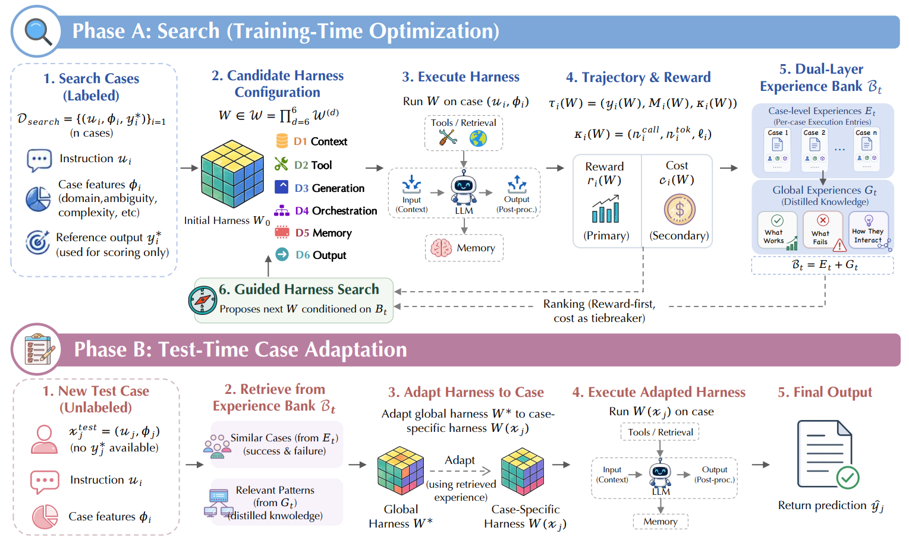

<h1 align="center">MemoHarness</h1>
<h3 align="center">Agent Harnesses That Learn from Experience</h3>

<p align="center">
  <a href="https://arxiv.org/abs/2607.14159"></a> 
  
  
  <!--  -->
  <!-- <br/>
  
  
   -->

</p>

<p align="center">
  <a href="#news">News</a> |
  <a href="#overview">Overview</a> |
  <a href="#method-at-a-glance">Method</a> |
  <a href="#the-six-dimensional-harness-model-d1-d6">Dimensions</a> |
  <a href="#quick-start">Quick Start</a> |
  <a href="#outputs">Outputs</a>
</p>

---

## News

- **2026-07-28** - Fixed tool-use telemetry, trial result labelling, and timeout handling in the search loop.

- **2026-07-14** - Paper released on [arxiv](https://arxiv.org/abs/2607.14159)

---

## Overview

MemoHarness optimizes the **agent harness** rather than the base model itself.  
Here, a harness is the control layer around the model: how context is built, which tools are exposed, how decoding is configured, how multi-step calls are orchestrated, what memory persists, and how outputs are validated.

Most agent systems ship one fixed global harness for all tasks. MemoHarness instead learns from execution experience and then specializes the harness per case at evaluation time, **without test-time labels, feedback, or extra search rounds**.

---

## Method

<p align="center">
  
</p>
<p align="center">
  <em>
    Figure 1: Overview of MemoHarness. Phase A performs training-time search over the six-dimensional harness space, storing case-level entries and distilled global patterns in a dual-layer experience bank. Phase B adapts the selected global harness to each unlabeled test case by retrieving similar cases and relevant patterns, then executes the case-specific harness to produce the final prediction.
  </em>
</p>
MemoHarness follows the same two-phase design:

1. **Training-time search** over a six-dimensional harness space.
2. **Test-time case adaptation** using a frozen experience bank.

Three design choices define the method:

- **Six-dimensional harness space**: structured edits over separable control surfaces (D1-D6), not one opaque prompt.
- **Dual-layer experience bank**: $B_t = (E_t, G_t)$ where $E_t$ stores per-case execution entries and $G_t$ stores distilled global patterns.
- **Correctness-first selection**: optimize task reward first; use token cost only as a tiebreaker.

### The Six-Dimensional Harness Model (D1-D6)

| Dimension                 | Stage                           | Definition                                                   | Example operations                                     |
| ------------------------- | ------------------------------- | ------------------------------------------------------------ | ------------------------------------------------------ |
| **D1 Context assembly**   | Pre-call input construction     | Builds the model input from instructions, constraints, retrieved material, and examples. | structure prompt; add demos; compress context          |
| **D2 Tool interaction**   | External tool and retrieval use | Controls when and how the harness calls external tools or retrievers. | enable retrieval; set top-k; rerank evidence           |
| **D3 Generation control** | Decoding configuration          | Sets the sampling and budget parameters for model generation. | raise max tokens; lower temperature; sample candidates |
| **D4 Orchestration**      | Workflow topology               | Chooses the sequence of model calls and intermediate reasoning steps. | single call → plan/execute/refine                      |
| **D5 Memory management**  | Cross-call state persistence    | Determines what state persists across calls and what stale context is removed. | keep state; summarize trace; drop stale context        |
| **D6 Output processing**  | Post-call output handling       | Transforms raw model output into the final answer returned by the harness. | extract answer; validate schema; choose fallback       |

---

## Quick Start

### Prerequisites

- Python `>=3.10`
- A working Harbor + Daytona environment
- At least one model provider key (for example OpenAI/OpenRouter)

### 1. Install

```bash
conda create -n harness python=3.11 -y
conda activate harness

pip install -e .
pip install -e ".[openai]"
pip install harbor daytona openai
```

### 2. Configure

Edit `configs/experiment.json`:

- set provider credentials (`providers`)
- set model registry (`models`)
- choose `active_model`
- set experiment and harness options (`experiment`, `harness`)

### 3. Run Training

```bash
memoharness --config configs/experiment.json
```

or

```bash
python -m memoharness.harbor.loop --config configs/experiment.json
```

### 4. Evaluation Only

```bash
python -m memoharness.harbor.loop --config configs/experiment.json --eval-only
```

---

## Result Snapshot

<p align="center">
  
</p>
<p align="center">
  <em>
    Figure 2: Per-iteration success rate on FinanceAgent (left) and LiveCodeBench (right) over 10 search rounds. FinanceAgent continues to benefit from additional iterations, rising from 42.5% to a 65.0% peak around iterations 8 and 9, whereas LiveCodeBench saturates almost immediately near the base-model ceiling and oscillates within a ~4pt band.
  </em>
</p>


---

## Repo Layout

```text
MemoHarness/
├─ README.md
├─ pyproject.toml
├─ configs/                  # experiment and harness configurations
├─ scripts/                  # evaluation and automation scripts
├─ images/                   # figures and README assets
├─ src/
│  └─ memoharness/
│     ├─ bank/               # dual-layer experience bank
│     ├─ controllers/        # Codex / LLM controllers
│     ├─ harbor/             # Harbor-Daytona runtime integration
│     ├─ llm/                # model, embedding, and distillation utilities
│     ├─ runtime/            # runtime execution bundles
│     └─ core/               # shared abstractions and data models
└─ ...
```

## Citation

If you find our work helpful, please consider citing it:

```bibtex
@misc{huang2026memoharness,
      title={MemoHarness: Agent Harnesses That Learn from Experience}, 
      author={Yue Huang and Wenjie Wang and Han Bao and Yuchen Ma and Xiaonan Luo and Yi Nian and Haomin Zhuang and Zheyuan Liu and Yue Zhao and Xiangliang Zhang},
      year={2026},
      eprint={2607.14159},
      archivePrefix={arXiv},
      primaryClass={cs.AI},
      url={[https://arxiv.org/abs/2607.14159](https://arxiv.org/abs/2607.14159)}, 
}
